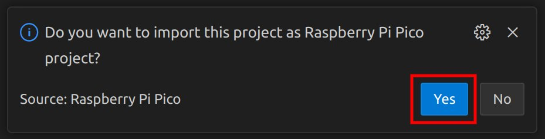
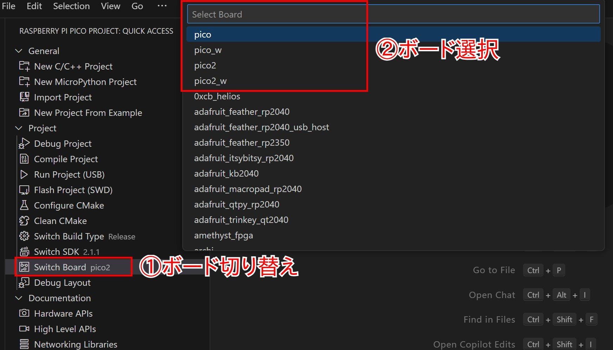
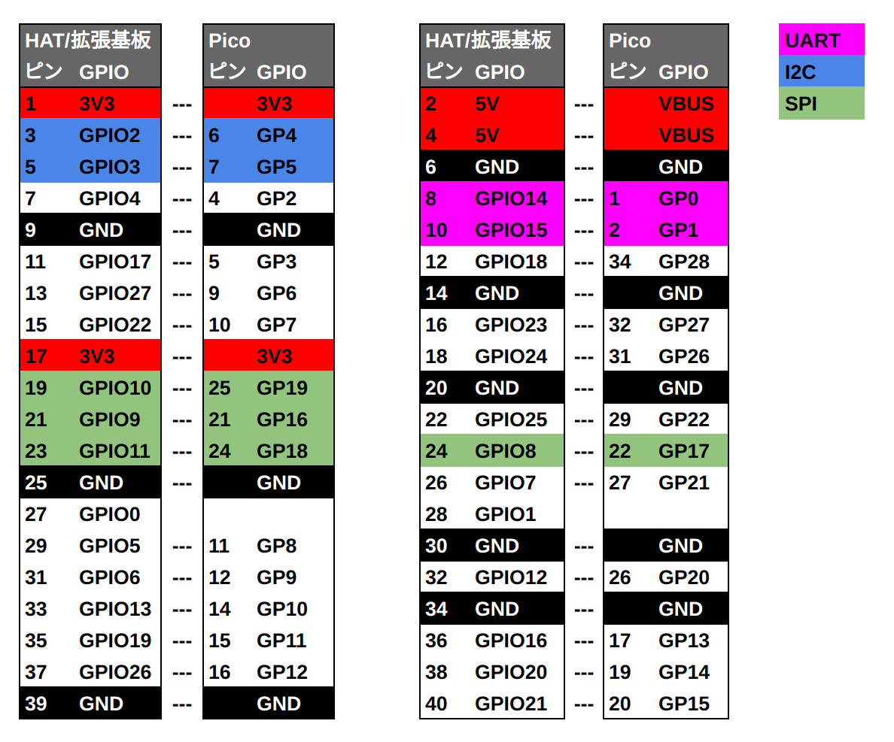

## RPP-HAT-Adapter

[RPP-HAT-Adapter](https://www.indoorcorgielec.com/products/rpp-hat-adapter/)
はRaspberry Pi用のHAT/拡張基板をRaspberry Pi Picoシリーズに接続して利用するためのアダプターです。

本リポジトリでは、Indoor Corgi製の各種拡張基板をPicoで動作させるサンプルプログラムを公開しています。
サンプルプログラムを利用することで、簡単に開発を始めることが可能です。

## サンプルプログラム一覧

| ディレクトリ名 | 機能 | 対応製品 |
| ---- | ---- | ---- |
| [ledsw](ledsw) | LED&スイッチ操作 | [RPi TPH Monitor](https://www.indoorcorgielec.com/products/rpi-tph-monitor-rev2/), [RPZ-IR-Sensor](https://www.indoorcorgielec.com/products/rpz-ir-sensor/), [RPZ-PIRS](https://www.indoorcorgielec.com/products/rpz-pirs/), [RPZ-CO2-Sensor](https://www.indoorcorgielec.com/products/rpz-co2-sensor/) |
| [infrared](infrared) | 赤外線送受信 | [RPi TPH Monitor](https://www.indoorcorgielec.com/products/rpi-tph-monitor-rev2/), [RPZ-IR-Sensor](https://www.indoorcorgielec.com/products/rpz-ir-sensor/), [RPZ-PIRS](https://www.indoorcorgielec.com/products/rpz-pirs/) |
| [bm280](bme280) | 温度、湿度、気圧センサー | [RPi TPH Monitor](https://www.indoorcorgielec.com/products/rpi-tph-monitor-rev2/), [RPZ-IR-Sensor](https://www.indoorcorgielec.com/products/rpz-ir-sensor/), [RPZ-PIRS](https://www.indoorcorgielec.com/products/rpz-pirs/), [RPZ-CO2-Sensor](https://www.indoorcorgielec.com/products/rpz-co2-sensor/) |
| [tsl2572](tsl2572) | 明るさ(照度)センサー | [RPZ-IR-Sensor](https://www.indoorcorgielec.com/products/rpz-ir-sensor/), [RPZ-PIRS](https://www.indoorcorgielec.com/products/rpz-pirs/) |
| [scd41](scd41) | CO2(二酸化炭素)センサー | [RPZ-CO2-Sensor](https://www.indoorcorgielec.com/products/rpz-co2-sensor/) |
| [pir](pir) | 人感センサー | [RPZ-PIRS](https://www.indoorcorgielec.com/products/rpz-pirs/) |
| [relay](relay) | リレー | [RPZ-CO2-Sensor](https://www.indoorcorgielec.com/products/rpz-co2-sensor/) |
| [lcdaqm](lcdaqm) | LCDディスプレイ | [RPi TPH Monitor](https://www.indoorcorgielec.com/products/rpi-tph-monitor-rev2/) |

## 使い方

### 開発環境

サンプルプログラムは、VS Code + Raspberry Pi Pico拡張機能を利用したC/C++ SDK開発環境
向けのプロジェクトとなっています。
開発環境の導入方法は
[こちら](https://www.indoorcorgielec.com/resources/pico/csdk/)
で解説しています。

### サンプルプログラムのダウンロード

本GitHubページ上部の「Code」ボタンをクリックし、「Download ZIP」をクリックすることで全ファイルがダウンロードできます。zipファイルは解凍しておきます。

### VS Codeで開く

使用したいサンプルプログラムのフォルダー(ディレクトリ)をVS Codeで開きます。
VS Codeメニューの「File」->「Open Folder」もしくはファイルマネージャーの右クリックメニューから開いてください。

Raspberry Pi Pico拡張機能が追加済みであれば、以下のようにインポートするかのダイアログが出るので、「Yes」をクリックし、その後インポート画面で「Import」をクリックします。

### ボードの変更

サンプルプログラムで設定されているボードがお使いのボードと異なる場合は、Pico拡張機能メニューの「Switch Board」をクリックし①、使用しているボード(Pico W、Pico 2など)に合わせてください②。Use Risc-V?と聞かれた場合はNoを選択します。

これ以降は通常の方法通り、プログラムをコンパイル、書き込みできると思います。
各サンプルプログラムのディレクトリ内のREADMEに、それぞれのサンプルの使い方を記載しています。

### シリアルモニター

サンプルプログラムの一部は、USBとUART0/GP0の両方へ動作ログを出力します。
シリアルモニターでいずれかをモニターすることで、動作ログを確認することができます。
シリアルモニターの使い方については[こちらの記事](https://www.indoorcorgielec.com/resources/pico/serial-monitor/)を参照してください。

## HATとPicoの接続表

以下がRaspberry Pi HAT/拡張基板用の40ピンコネクターとPicoの接続表です。
GP4、GP5は3V3に1.8kΩでプルアップされています。

